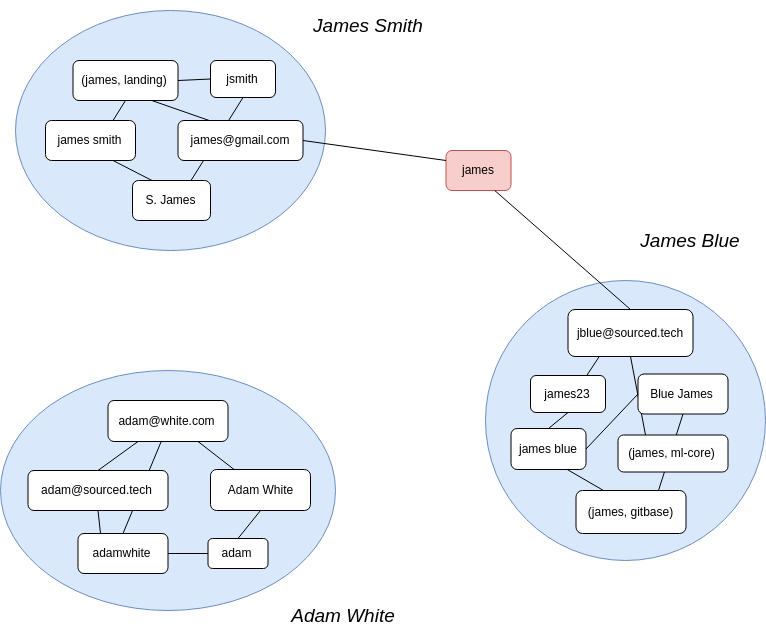
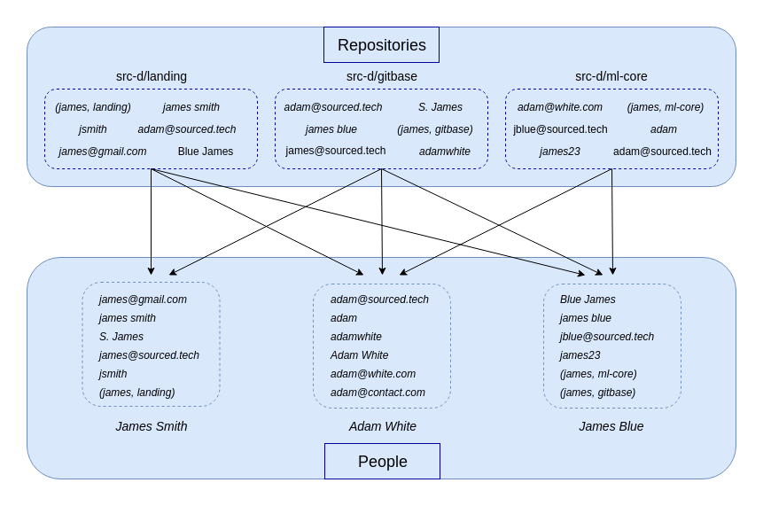

# Identity Matching source{d} Extension

[](https://travis-ci.com/src-d/identity-matching) [](https://codecov.io/gh/src-d/identity-matching) [](https://goreportcard.com/report/github.com/src-d/identity-matching) [](https://opensource.org/licenses/GPL-3.0)

Match different identities of the same person using 🤖. Extension for [source{d}](https://github.com/src-d/sourced-ce).

[Overview](#overview) • [How To Use](#how-to-use) • [Science](#science) • [Contributions](#contributions) • [License](#license)

## Overview

People are using different e-mails and names (aka identities) when they commit their work to git. 
E-mails can be corporate, personal, special like users.noreply.github.com, etc. 
Names can be with Surname or without, with typos, no name, etc. 
Thus to get precise information about developer it is required to gather their identities 
and separate them from another person identities. That's what we call Identity Matching.

<p align="center">
  
</p>

## How To Use

**Right now no pre-built binaries are available.**
Please refer to [How to build from source code](#how-to-build-from-source-code) section to build an executable.

Run `match-identities --help` to see all the parameters that you can configure. 

There are two use cases supported for `match-identities`.
1. [With gitbase](#use-with-gitbase)
2. [Without gitbase](#use-without-gitbase)

In both cases, the output identity table is saved as a Parquet file.
Read more in the [Output format](#output-format) section.

### Use with gitbase

`match-identities` is supposed to be used with [gitbase](https://github.com/src-d/gitbase). 
First of all, make sure you have a gitbase instance running with all the repositories you are going to analyze.
Please refer to the [gitbase](https://github.com/src-d/gitbase) documentation to get more information. 

Usage example:
```
match-identities --output matched_identities.parquet
```

The credentials can be configured with the `--host`, `--port`, `--user` and `--password` flags. 

For example, the following SQL gitbase query will return the identities of each commit author:
```sql
SELECT DISTINCT repository_id, commit_author_name, commit_author_email
FROM commits;
```

If you want to cache the gitbase output you can use the `--cache` flag. 
After the identities are fetched from gitbase, the matching process is run. 
Read [Science](#Science) section to learn more.

### Use without gitbase
If you run `match-identities` with the `--cache` option enabled you get a `csv` file with the cached [gitbase](https://github.com/src-d/gitbase) output.
Besides, if you already have a list of identities it is possible to run `match-identities` without gitbase involved.
Create a CSV file with the columns `repo`, `email` and `name`, then feed it to the `--cache` parameter.

Usage Example:
```
match-identities \
    --cache path/to/csv/file.csv \
    --output matched_identities.parquet
```

### Output format 
Once the algorithm finishes to merge identities, you get a table with 4 columns: 
1. `id` (`int64`) -- unique identifier of the person with the corresponding identity. 
2. `email` (`utf8`) -- e-mail of the identity.
3. `name` (`utf8`) -- name of the identity.
4. `repo` (`utf8`) -- repository of the commit.


The columns `email`, `name` and `repo` may contain empty values which means no constraints.
For example, let's consider this output identity table:
```
id,email,name,repo
1,alice@gmail.com,"",""
1,"",alice,""
2,bob@gmail.com,"",""
2,"",bob,""
2,bob@inbox.com,"",""
2,"",no-name,bob/bobs-project
```

There are two developers. 
Let's name them Alice (with id 1) and Bob (with id 2). 
When we analyze a commit with `alice@gmail.com` as author email, then the author is Alice.
The repository and author name are ignored since the author email is the most reliable way to define an identity.
On the other hand, when we analyze a commit with `alice` as an author name, then the author is Alice for whatever combination of email and repository.
Same for Bob, although he uses two different email addresses `bob@gmail.com` and `bob@inbox.com`.
If we come across a commit with the `no-name` author name in `bob/bobs-project` repository then it is Bob's. 

### Convert parquet to CSV

It is possible to convert the output parquet file to CSV using the python script in the `research` directory:
```bash 
python3 ./research/parquet2csv.py matched_identities.parquet
```
The result will be saved as `matched_identities.csv`.
Please note that pyspark must be installed. 

### External matching option

If the organization is using GitHub, Gitlab or Bitbucket, it is possible to use their API to match identities by emails. In that case, 2 columns are added and filled for every email in the table: the `External id provider` and the `External id` itself.

## How to build

```bash
git clone https://github.com/src-d/identity-matching
cd identity-matching
make build
```

You'll see two directories with Linux and Macos binaries inside the `build` directory. 

## Science

There are two stages to match identities. 
The first is the precomputation which is run once on the whole dataset and remains unchanged during the subsequent steps. 
The second is the matching itself.
1. Precomputation:
    1. Gather 2 lists of the most popular names and emails (by frequencies) on the whole dataset.
    2. Gather 2 lists of emails and names that will be ignored (aka blacklists) on the whole dataset.
       They are non-human identities and usually related to CI, bots, etc.
2. Analysis:
   1. Gather the list of triplets `{email, name, repository}` from all the commits using gitbase.
   2. Remove any triplet whose name or email belongs to the blacklists. 
   3. Merge identities with the same e-mail if it doesn't belong to the list of popular emails created in 1.1.
   4. Merge identities with the same name if it doesn't belong to the list of popular names created in 1.1.
      When the name belongs to this list we replace it with the following tuple `(name, repository)`. 
   5. Save the resulting identity table in the desired output format.

<p align="center">
  
</p>

There is a Design Document (or a Blueprint, or whatever else you are used to call project documentation) which goes into more detail:
[link](https://docs.google.com/document/d/1oNo_rS5mHqEVk_yug8hbMWIpQaJeOUYZitR3jWnHJCs/edit#heading=h.qhzm4nnshexd).

## Contributions

...are welcome! See [CONTRIBUTING](CONTRIBUTING.md) and [code of conduct](CODE_OF_CONDUCT.md).

## License

GPL 3.0, see [LICENSE](LICENSE). Y u no Apache/MIT? [Read here.](https://github.com/src-d/guide/blob/master/engineering/licensing.md#licence)
